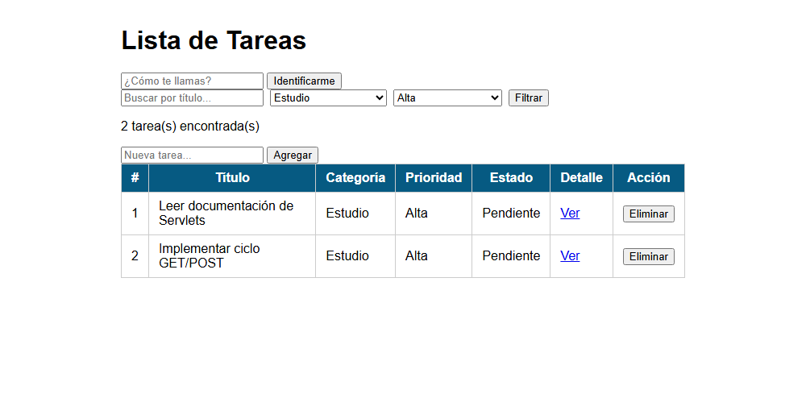
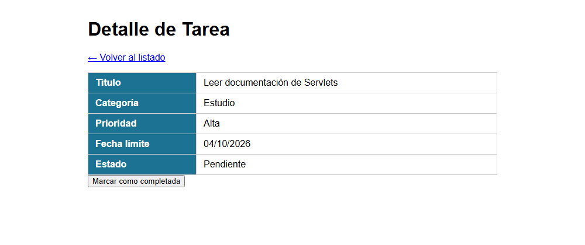

# Post-contenido Unidad 5: fundamentos de Java Web (Servlets y JSP)

## Descripción
Repositorio del laboratorio de la Unidad 5 de Programación Web (séptimo semestre). Contiene un único proyecto Maven Web, `gestion-tareas`, que se construye en dos partes sobre el mismo dominio de tareas. La Parte 1 crea el Servlet base con el ciclo GET/POST y el patrón Post/Redirect/Get. La Parte 2 añade filtrado combinado, una vista de detalle servida por un segundo Servlet y una sesión que recuerda el nombre del usuario y el último filtro.

## Parte 1: Servlet de gestión de tareas
`TareasServlet` atiende GET (listar) y POST (agregar y eliminar). Valida en el servidor que el título no esté vacío y redirige después de cada POST, de modo que recargar la página no reenvía el formulario.

## Parte 2: filtros, detalle y sesión
`TareasServlet` filtra por texto, categoría y prioridad a la vez y suma las acciones completar e identificar. `DetalleTareaServlet` lee la misma lista desde `applicationScope` y hace forward a `detalle.jsp`. `HttpSession` guarda el nombre del usuario y el último filtro aplicado.

## Decisiones de diseño
- La lista de tareas es una variable de instancia porque es el estado compartido de toda la aplicación y todas las peticiones deben ver la misma lista. Los datos de una sola petición, como el `titulo` que lee `doPost`, sí son variables locales del método.
- El filtro activo y el nombre del usuario se guardan en `HttpSession` porque tienen que sobrevivir a varias peticiones, por ejemplo al navegar entre `/tareas` y `/tareas/detalle`. La lista ya filtrada va en el request, ya que solo sirve para esa respuesta.
- `DetalleTareaServlet` obtiene las tareas desde el `ServletContext` (`applicationScope`) para no duplicar la lista. Usa forward porque solo entrega un objeto ya calculado a una vista, sin pedirle al navegador una nueva petición. Las acciones POST usan redirect (Post/Redirect/Get) para que la recarga no reenvíe el formulario.
- Los estilos pasaron a `css/estilos.css` cuando apareció la segunda vista (`detalle.jsp`), para no repetir el bloque `<style>` de la Parte 1 en cada JSP.

## Cómo compilar y desplegar
Requisitos: JDK 17, Maven 3.8 o superior y Apache Tomcat 10.x.

1. Clonar el repositorio: `git clone https://github.com/julianejurado-rgb/jurado-post1-u5.git`
2. Abrir la carpeta como proyecto Maven en el IDE.
3. Ejecutar `mvn clean package`. Genera `target/gestion-tareas-1.0-SNAPSHOT.war`.
4. Desplegar en Tomcat: configurar un servidor Tomcat local en el IDE con el artefacto war exploded de `gestion-tareas`, o copiar el WAR a la carpeta `webapps` de Tomcat con el nombre `gestion-tareas.war`.
5. Abrir `http://localhost:8080/gestion-tareas/tareas`.

## Capturas de pantalla
Lista filtrada por categoría Estudio y prioridad Alta:

Detalle de una tarea:

